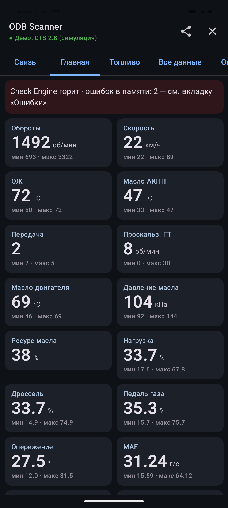
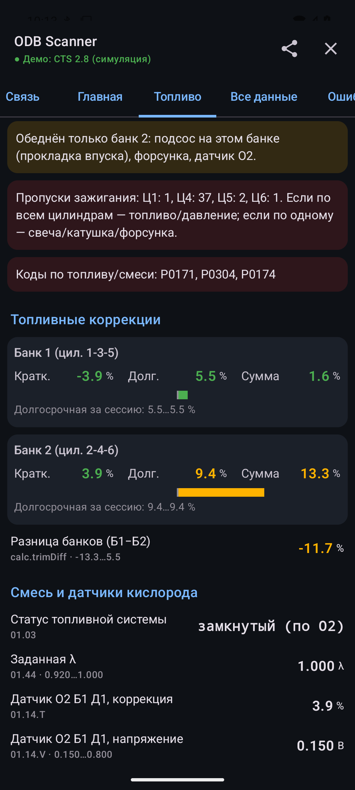
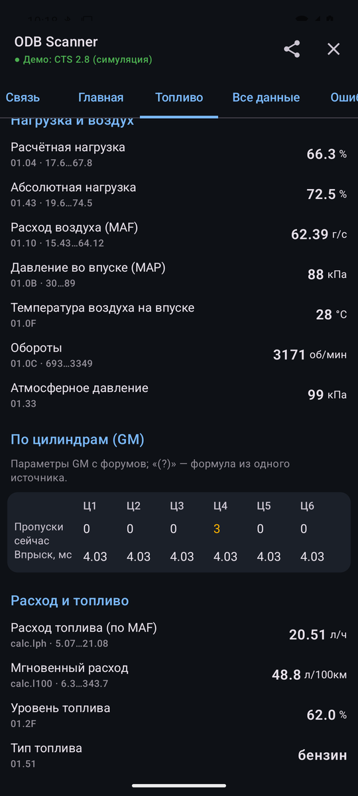
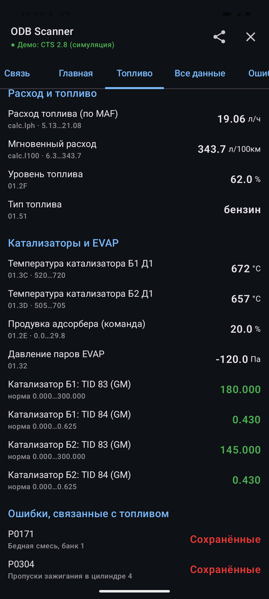
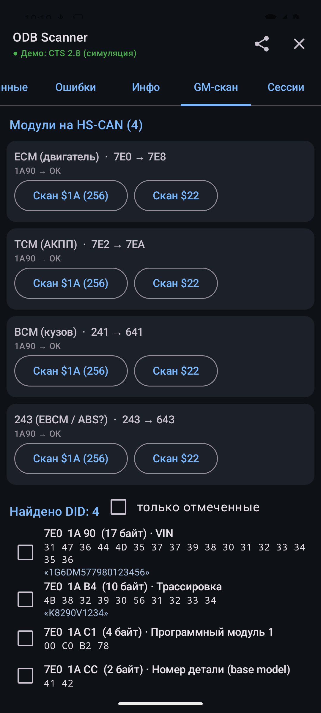
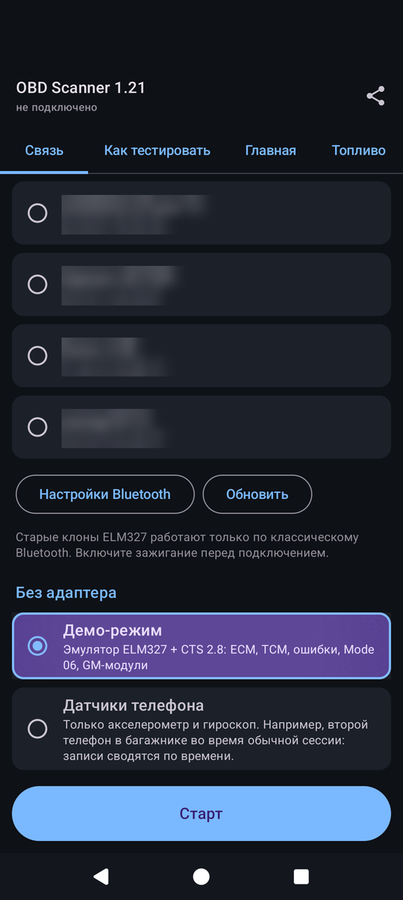

# OBD Scanner

Android-приложение для чтения данных из машины через ELM327 (Bluetooth). Сделано под Cadillac CTS 2-го поколения (2.8 V6, АКПП 6L50), проверяется и на других машинах (см. «Машины»).

Язык — по системному: на русской системе русский, на любой другой английский (в Android 13+ можно выбрать отдельно в настройках приложения). Тексты в коде — `tr("…", "…")` из `L10n.kt`, тексты справки и гайда — ресурсы `res/values` (англ.) и `res/values-ru`. Файлы сессии пишутся на языке приложения; скрипты в `utils/` понимают оба.

<table>
  <tr>
    <td></td>
    <td></td>
    <td></td>
  </tr>
  <tr>
    <td align="center">Главная</td>
    <td align="center">Топливо: коррекции, подсказки</td>
    <td align="center">Топливо: по цилиндрам, расход</td>
  </tr>
  <tr>
    <td></td>
    <td></td>
    <td></td>
  </tr>
  <tr>
    <td align="center">Катализаторы, EVAP, ошибки</td>
    <td align="center">GM-скан: модули и DID</td>
    <td align="center">Связь, демо-режим</td>
  </tr>
</table>

## Машины

В целом везде одно и то же — стандартный OBD-II: параметры, ошибки, готовность, Mode 06. Но у каждой машины свои нюансы — протокол, адреса блоков, команды производителя, место разъёма, — и мы стараемся их учитывать (см. «База машин»). Марка и модель определяются по VIN, машину можно выбрать и вручную («Связь» или «Как тестировать» → «Выбрать»: марка → модель и поколение).

Проверено на машинах:

- **Cadillac CTS 2008–2014 (2.8 V6)** — основная машина. CAN; сверх стандарта — GM-параметры ($22), ошибки всех блоков HS-CAN ($A9), GM-скан и прослушка шины.
- **Volkswagen Polo** — K-line (ISO 14230, KWP 5-baud), только стандартный OBD; VIN в Mode 09 нет. На CAN-машинах VW — поиск блоков, их идентификация и ошибки (см. «Volkswagen»).
- **Toyota RAV4 2005 (1AZ-FE)** — CAN 11/500, VIN блок не отдаёт. Расширенные данные двигателя — скан $21 (KWP, как в Techstream) с записью в сессию для последующей расшифровки.
- **Lada Vesta**, **Hyundai Solaris** — стандартный OBD плюс поиск блоков: идентификация (UDS $22 F1xx / KWP $1A) и ошибки (UDS $19 / KWP $18).

Поиск блоков (кроме GM и VAG) — общий список (7E0–7E7 и частые адреса), свой для семейства (`ObdModules` в [EcuIdent.kt](app/src/main/java/com/obdscanner/obd/EcuIdent.kt)) и все блоки, к которым обращаются команды базы. У Renault/Nissan/Lada (платформа Renault) кузовные блоки отвечают на +0x20 (743→763 приборка, 740→760 ABS, 745→765 кузовной блок… — по таблицам pyren/ddt4all), у Haval — на +0x40; у Toyota, Hyundai/Kia, Ford/Mazda, Subaru — дополнительные адреса, отвечавшие на реальных машинах (openpilot/opendbc, OVMS).

Расход ([FuelRate.kt](app/src/main/java/com/obdscanner/obd/FuelRate.kt)), по первому доступному: PID 5E, PID 9D, у дизеля — цикловая подача (A2 × цилиндры × обороты; по MAF дизель не считается — смесь бедная, вышло бы в разы больше), по MAF со стехиометрией и плотностью своего топлива (PID 51 или база), без MAF — по MAP, температуре воздуха, оборотам и объёму двигателя из базы (наполнение ≈ 0,85, помечено «оценка»).

## База машин

`app/src/main/assets/cars/` — JSON по семействам марок (GM, VAG, Toyota/Lexus, Hyundai/Kia, Lada, Renault, Nissan, Ford, Mazda, BMW, Mercedes, Honda, Mitsubishi, Subaru, Suzuki, китайцы). Формат — [tools/cars/SCHEMA.md](tools/cars/SCHEMA.md).

| Что | Сколько | Для чего |
|---|---|---|
| Марки с кодами VIN (WMI) | 42 | марка по VIN, семейство (какие шаги и параметры) |
| Модели по поколениям | 256 | годы, двигатели, протокол (пробуется первым), место разъёма, шины, заметки |
| Команды производителя, собраны вручную | 105 (171 значение) | масло АКПП/DSG/вариатора, ресурс масла, наддув, сажа DPF, BMS электромобилей, пробег… |
| Команды из [OBDb](https://github.com/OBDb) | 3228 (5788 значений) | то же, по моделям; CC BY-SA 4.0 |

- `<семейство>.json` собраны по открытым источникам (форумы, drive2, списки PID Torque, GitHub, OBDb для сверки), у каждой модели и значения — ссылки `src`. `conf: "OK"` — два независимых источника или проверено на машине, иначе в приложении «(?)».
- `obdb/<семейство>.json` — генерируются [tools/cars/obdb_import.py](tools/cars/obdb_import.py) (`python tools/cars/obdb_import.py [--refresh] [семейство …]`), русские названия — [tools/cars/obdb_ru.json](tools/cars/obdb_ru.json). Все значения OBDb — «(?)».
- Роль значения (`role`: `oil_temp`, `atf_temp`, `cvt_temp`…) ставит его в нужную карточку «Главной» на любой марке.

Безопасность — проверяется в загрузчике ([CarDb.kt](app/src/main/java/com/obdscanner/car/CarDb.kt)), ещё раз перед отправкой и в unit-тесте на всех файлах:
- только чтение: `$22` (ReadDataByIdentifier) и `$21` (ReadDataByLocalIdentifier); ни сессий, ни доступа, ни записи, ни процедур;
- только физические 11-битные диагностические адреса `700–7FF`, без широковещательного `7DF`. Другие id отбрасываются: на чужой машине они могут быть обычными сообщениями шины;
- `fuel: ["diesel"]` — запрос уходит только на машину, про которую известно, что она дизель (PID 51 или все двигатели модели): у VAG тот же DID на бензиновом блоке — пропуски, а не сажа;
- запрос, известный на другой модели или другом двигателе, всё равно проверяется, но его значения — «(?)»;
- при подключении — не больше 200 проверок, блок, трижды не ответивший подряд, дальше не спрашивается; в цикле опроса — не больше 5 таких запросов.

Место разъёма — шесть общих картинок по местам (`left_door`, `under_column`, `right_of_column`, `left_cover`, `console`, `passenger`): [art/obd/make_obd_art.py](art/obd/make_obd_art.py) → `res/drawable-nodpi/obd_loc_*.webp`.

Не поддерживается: 29-битные адреса (Honda с ~2008, часть VAG/Renault), расширенная адресация BMW (6F1), запросы, которым нужна диагностическая сессия.

## Что читает

При подключении:
- Mode 01 — все поддерживаемые PID всех ответивших блоков;
- Mode 09 — VIN, калибровки, CVN, имена блоков, счётчики мониторов;
- ошибки 03 / 07 / 0A, стоп-кадр (Mode 02);
- готовность мониторов;
- Mode 06 — все бортовые тесты, включая пропуски по цилиндрам;
- шаги по марке (см. «Машины»): GM-шаги ($A9) — только для GM, ручной GM-скан доступен всегда;
- параметры производителя ($21 / $22) из базы машин, на GM ещё ~45 известных GM-параметров: при первом подключении проверяются, дальше опрашиваются ответившие (запоминаются по VIN);
- GM $A9 — ошибки всех блоков HS-CAN. Модули ищутся при первом подключении (~1 мин) и запоминаются по VIN, дальше несколько секунд на блок. После этого адаптер проверяется (`0100`), при необходимости переинициализируется.

## Вкладки

| Вкладка | Содержимое |
|---|---|
| Связь | Спаренные адаптеры, демо-режим |
| Главная | Основные параметры по цветным секциям (двигатель, масло, АКПП, топливо, электрика), мин/макс за сессию |
| Топливо | Коррекции, датчики O2, λ, зажигание, детонация, таблица по цилиндрам, расход, катализаторы, EVAP, подсказки |
| Все данные | Все значения всех блоков |
| Ошибки | Чтение, сброс (с подтверждением), стоп-кадр; полная память ошибок всех блоков GM ($A9) |
| Инфо | Адаптер, VIN, блоки, готовность, Mode 06 |
| GM-скан | Поиск модулей, скан $1A / $21 / $22, отслеживание найденного, прослушка шины |
| Сессии | Список сессий, отправка, удаление |

Касание карточки на «Главной» открывает справку: значение, мин/макс, откуда берётся, «Что это / Норма / Если не так». Тексты — в `app/src/main/res/values-ru/help_*.xml` (по файлу на секцию) и `strings.xml`, английские — те же файлы в `values/`. Правило для текстов: только проверенное (стандарт, источники, логи этой машины). Чего не знаем — так и пишем.

## Сессии

Каждое подключение — папка сессии, запись с первой команды.

| Файл | Содержимое |
|---|---|
| `raw.log` | Весь обмен с адаптером с временем |
| `data.csv` | Декодированные значения; при изменении, иначе не чаще 1 раза/с |
| `report.txt` | Сводка: версия, адаптер, протокол, PID, VIN, ошибки, Mode 06, GM, модули |
| `scan.csv` | Находки GM-скана |
| `bus.csv` | Кадры прослушки шины |

⇪ в заголовке — zip текущей (или последней) сессии и «Поделиться». Для старых — вкладка «Сессии».

## Адаптер и машина

- ELM327 с классическим Bluetooth. Спарить в настройках Android, PIN `1234` или `0000`.
- CAN (ISO 15765-4) — всё. K-line (ISO 9141-2, ISO 14230) — только стандартный OBD: без поиска блоков, их ошибок, GM-параметров и прослушки; Mode 06 пишется в `report.txt` без расшифровки.
- Протокол ищется перебором по одному: сначала последний удачный, потом CAN, K-line (с паузой 3 с между попытками и вторым кругом), остальные. Автопоиск адаптера (`ATSP0`) не используется: клон v1.5 на Polo (KWP 5-baud) каждый раз на нём отключался и минутами не отвечал по Bluetooth. Если адаптер всё же отключился — переподключение без этого протокола.
- Bluetooth: попытка — не дольше 10 с; первым пробуется способ, сработавший в прошлый раз с этим адаптером.
- Сбои клонов обрабатываются: проверка порядка кадров ISO-TP, повтор битых ответов, повтор команд после `STOPPED`.
- Сброс адаптера посреди сессии (`LV RESET` при прокрутке стартера, `ERR94`, баннер `ELM327 v…` у клонов) распознаётся: адаптер снова получает настройки формата, тайминг и найденный протокол (иначе он в автопоиске, который ронял клон на Polo), адресация восстанавливается, запрос повторяется.
- После каждого `ATSP`/`ATPC` настройки формата отправляются заново: часть клонов (VLinker…) сбрасывает их при смене протокола. Строки Bluetooth-модуля (`+CONNECTING…`) отбрасываются, ответ, приклеенный к `SEARCHING...`/`BUS INIT: ...OK`, сохраняется.

Шины CTS 2008–2014:
- HS-CAN (пины 6/14, 500 кбит/с): двигатель, АКПП, ABS, BCM и др. — доступны;
- GMLAN SW-CAN (пин 1, 33 кбит/с): подушки, приборка, радио, климат, TPMS, парктроники — ELM327 недоступны, нужен адаптер с SW-CAN (OBDLink MX+).

## Volkswagen

Марка — по VIN (`WVW`, `XW8`, `WVG`… — [Make.kt](app/src/main/java/com/obdscanner/obd/Make.kt)). Только чтение: $3E, $22, $1A, $19, $18.
- Поиск блоков: 7E0–7E7 (ответ +8) и 700–775 (UDS VW, ответ +0x6A), пробы `3E00`, `22F187`. Запоминаются по VIN.
- Идентификация каждого блока: UDS $22 F187/F189/F191/F197/… и кодирование 0600, или KWP $1A 9B/91/86 — в `report.txt` и `scan.csv`.
- Ошибки всех блоков: UDS `19 02 FF`, для старых блоков KWP `18 02 FF00` (VAG-номер, 16384+N = P0N).
- Блоки на VW TP 2.0 (старые KWP-машины) ELM327 не видит — найдутся только двигатель и КПП. K-line (Polo 9N) не поддерживается.
- Имена блоков кроме 7E0/7E1 — по спискам адресов VW, на машине не проверены («(?)»).

## GM-параметры

Таблица: [GmKnown.kt](app/src/main/java/com/obdscanner/gm/GmKnown.kt). Источники: Holden VE/VF, списки GM Class 2, OBDb.
- без пометки — несколько источников или проверено на машине;
- «(?)» — один источник или расхождения.

Проверено на машине: 22 1940 (масло АКПП), 22 1941 (входной вал, ×0.125), 22 1991 (проскальзывание ГТ), 22 1141 (IGN1), 22 11A1 (время работы).

## GM-скан и прослушка

- Поиск модулей — опрос ~40 диагностических адресов HS-CAN, затем идентификация каждого найденного модуля ($1A: имя, дата программирования, номера программ и детали) — в `scan.csv` и `report.txt`.
- Ошибки всех блоков («Ошибки» → «Прочитать все блоки») — GMLAN `$A9 81` с маской `5A` (активные, история, после сброса) в каждый найденный модуль. В отличие от Mode 03 показывает коды без Check, коды ABS/BCM и байт типа отказа (`C0035 5A`). Коды приходят UUDT-кадрами на `0x5xx`, поэтому на время запроса адаптер переключается в `ATCAF0`, потом восстанавливается. Только чтение, ничего не стирается.
- Скан $1A / $22 — перебор DID выбранного модуля, только чтение, результат в `scan.csv`. Галочка — опрос DID в реальном времени.
- Прослушка шины — пассивная (`ATCSM1`, `ATMA`): ~10 с обзор ID, затем по 1.5 с на каждый ID через фильтр. Результат в `bus.csv`, сводка в `report.txt`. Только по кнопке; после неё адаптер возвращается в обычный режим.

Сканы и прослушку делать на стоящей машине.

## Сборка

Нужны Android SDK (в скриптах `E:\Android\Sdk`), JDK 17, телефон с отладкой по USB.

VS Code (Ctrl+Shift+P → Tasks: Run Task):

| Задача | Действие |
|---|---|
| OBD: Run on Phone (Ctrl+Shift+B) | Сборка, установка, запуск. Выбирает физический телефон; другое устройство — `-Serial` |
| OBD: Logcat (OBD) | Лог обмена с адаптером (тег `OBD`) и падений |
| OBD: Unit tests | Тесты |

Консоль:

```
gradlew assembleDebug        # APK: app/build/outputs/apk/debug/OBDScanner_PavelArkhipov_<версия>.apk
gradlew installDebug         # сборка и установка
gradlew testDebugUnitTest    # тесты
```

Версия — в заголовке приложения и в `report.txt`. Поднимать `versionName` и `versionCode` в [app/build.gradle.kts](app/build.gradle.kts) с каждой сборкой: `versionName` на 0.01 (1.0 → 1.01 → 1.02 …), `versionCode` на 1.

## Демо-режим

Вкладка «Связь» → «Демо-режим»: эмулятор ELM327 v1.5 + CTS 2.8 ([MockTransport.kt](app/src/main/java/com/obdscanner/transport/MockTransport.kt)). Двигатель, АКПП, BCM, многокадровые ответы, ошибки, Mode 06, GM-параметры, трафик для прослушки. На нём же unit-тесты.

## Код

```
app/src/main/java/com/obdscanner/
├── ObdManager.kt    подключение, опрос, цикл чтения, действия
├── ObdService.kt    фоновый сервис (запись при выключенном экране)
├── MainActivity.kt  заголовок, вкладки
├── transport/       Bluetooth SPP, эмулятор
├── elm/             драйвер ELM327, разбор CAN/ISO-TP, адресация
├── obd/             PID и формулы, ошибки, Mode 06, Mode 09, готовность
├── car/             база машин: загрузка, определение по VIN, декодер значений
├── gm/              GM-параметры, поиск модулей, скан DID
├── bus/             прослушка шины
├── session/         запись сессий, zip
└── ui/              экраны (Jetpack Compose)
```

Исходник иконки: [art/icon.png](art/icon.png). База машин: `app/src/main/assets/cars/`, инструменты и формат — `tools/cars/`.
