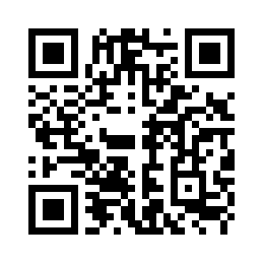
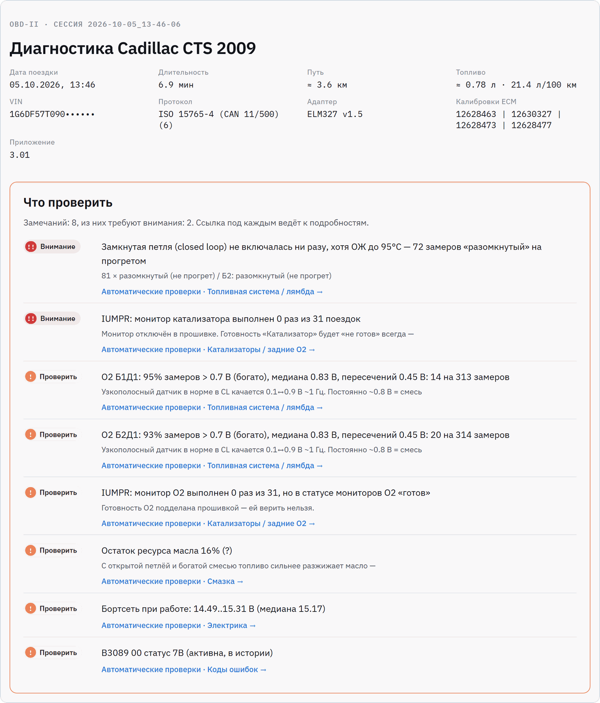
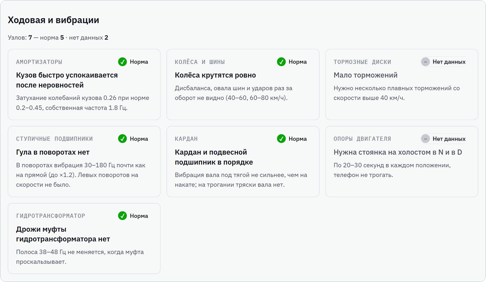
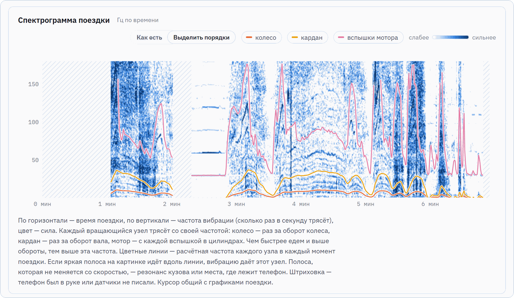
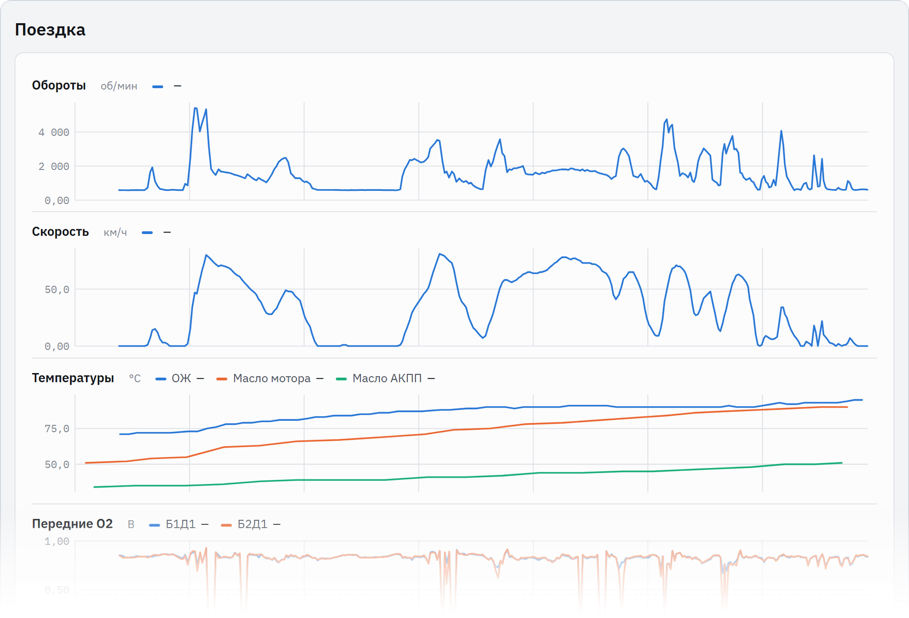

# OBD Scanner

Android-приложение для чтения данных из машины через ELM327 (Bluetooth, USB или Wi-Fi). Сделано под Cadillac CTS 2-го поколения (2.8 V6, АКПП 6L50), проверяется и на других машинах (см. «Машины»).

Язык — по системному: на русской системе русский, на любой другой английский (в Android 13+ можно выбрать отдельно в настройках приложения). Тексты в коде — `tr("…", "…")` из `L10n.kt`, тексты справки и гайда — ресурсы `res/values` (англ.) и `res/values-ru`. Файлы сессии пишутся на языке приложения; скрипты в `utils/` понимают оба.

<table>
  <tr>
    <td></td>
    <td></td>
    <td></td>
  </tr>
  <tr>
    <td align="center">Главная</td>
    <td align="center">Топливо: коррекции, подсказки</td>
    <td align="center">Топливо: по цилиндрам, расход</td>
  </tr>
  <tr>
    <td></td>
    <td></td>
    <td></td>
  </tr>
  <tr>
    <td align="center">Катализаторы, EVAP, ошибки</td>
    <td align="center">GM-скан: модули и DID</td>
    <td align="center">Связь: выбор источника, Старт</td>
  </tr>
</table>

## Поддержать проект

Приложение бесплатное и без рекламы. Поддержать разработку можно донатом по СБП из приложения любого банка или картой: [ссылка](https://pay.cloudtips.ru/p/b487c73c) или QR-код.



## Машины

В целом везде одно и то же — стандартный OBD-II: параметры, ошибки, готовность, Mode 06. Но у каждой машины свои нюансы — протокол, адреса блоков, команды производителя, место разъёма, — и мы стараемся их учитывать (см. «База машин»). Марка и модель определяются по VIN, машину можно выбрать и вручную («Связь» или «Как тестировать» → «Выбрать»: марка → модель и поколение). То, что говорит сама машина (VIN, модель по ответу блока), важнее ручного выбора. Если марка известна только по ручному выбору и блок не отвечает её способом чтения ошибок, они читаются стандартным, а на экране «Ошибки» появляется подсказка проверить марку.

Проверено на машинах:

- **Cadillac CTS 2008–2014 (2.8 V6)** — основная машина. CAN; сверх стандарта — GM-параметры ($22), ошибки всех блоков HS-CAN ($A9), GM-скан и прослушка шины.
- **Volkswagen Polo** — K-line (ISO 14230, KWP 5-baud), только стандартный OBD; VIN в Mode 09 нет. На CAN-машинах VW — поиск блоков, их идентификация и ошибки.
- **Toyota RAV4 2005 (1AZ-FE)** — CAN 11/500, VIN блок не отдаёт. Расширенные данные двигателя — скан $21 (KWP, как в Techstream) с записью в сессию для последующей расшифровки.
- **Lada Vesta**, **Hyundai Solaris** — стандартный OBD плюс поиск блоков: идентификация (UDS $22 F1xx / KWP $1A) и ошибки (UDS $19 / KWP $18).
- **Toyota Crown S180 (JDM, 4GR-FSE)** — CAN 11/500 без Mode 01/03 и без VIN: модель узнаётся по ответу блока двигателя (`21 C1` = «GRS18# 4GRFSE»), стандартные параметры читаются через $21 с теми же номерами PID (по записи сессии владельца).

Машина — это набор блоков (двигатель, КПП, ABS…), и у каждого блока свой **диалект**: как читать данные, ошибки и идентификацию, какие у него параметры. Диалект задаётся данными в базе (модель называет диалекты своих блоков; блок можно узнать по его ответу), так что новая машина — это правка JSON, а не кода. Подробно — [tools/cars/SCHEMA.md](tools/cars/SCHEMA.md).

Поиск блоков — общий список (7E0–7E7 и частые адреса), список марки (`modules` в её файле базы; у GM и VAG — свой вместо общего) и все блоки, к которым обращаются команды базы. У Renault/Nissan/Lada (платформа Renault) кузовные блоки отвечают на +0x20 (743→763 приборка, 740→760 ABS, 745→765 кузовной блок… — по таблицам pyren/ddt4all), у Haval — на +0x40; у Toyota, Hyundai/Kia, Ford/Mazda, Subaru — дополнительные адреса, отвечавшие на реальных машинах (openpilot/opendbc, OVMS).

Расход ([FuelRate.kt](app/src/main/java/com/obdscanner/obd/FuelRate.kt)), по первому доступному: PID 5E, PID 9D, у дизеля — цикловая подача (A2 × цилиндры × обороты; по MAF дизель не считается — смесь бедная, вышло бы в разы больше), по MAF со стехиометрией и плотностью своего топлива (PID 51 или база), без MAF — по MAP, температуре воздуха, оборотам и объёму двигателя из базы (наполнение ≈ 0,85, помечено «оценка»).

## База машин

`core/data/cars/` — JSON по семействам марок (GM, VAG, Toyota/Lexus, Hyundai/Kia, Lada, Renault, Nissan, Ford, Mazda, BMW, Mercedes, Honda, Mitsubishi, Subaru, Suzuki, китайцы). Формат — [tools/cars/SCHEMA.md](tools/cars/SCHEMA.md).

| Что | Сколько | Для чего |
|---|---|---|
| Марки с кодами VIN (WMI) | 42 | марка по VIN, семейство (какие шаги и параметры) |
| Модели по поколениям | 256 | годы, двигатели, протокол (пробуется первым), место разъёма, шины, заметки |
| Команды производителя, собраны вручную | 105 (171 значение) | масло АКПП/DSG/вариатора, ресурс масла, наддув, сажа DPF, BMS электромобилей, пробег… |
| Команды из [OBDb](https://github.com/OBDb) | 3228 (5788 значений) | то же, по моделям; CC BY-SA 4.0 |

- `<семейство>.json` собраны по открытым источникам (форумы, drive2, списки PID Torque, GitHub, OBDb для сверки), у каждой модели и значения — ссылки `src`. `conf: "OK"` — два независимых источника или проверено на машине, иначе в приложении «(?)».
- `obdb/<семейство>.json` — генерируются [tools/cars/obdb_import.py](tools/cars/obdb_import.py) (`python tools/cars/obdb_import.py [--refresh] [семейство …]`), русские названия — [tools/cars/obdb_ru.json](tools/cars/obdb_ru.json). Все значения OBDb — «(?)».
- Роль значения (`role`: `oil_temp`, `atf_temp`, `cvt_temp`…) ставит его в нужную карточку «Главной» на любой марке.

Безопасность — проверяется в загрузчике ([CarDb.kt](app/src/main/java/com/obdscanner/car/CarDb.kt)), ещё раз перед отправкой и в unit-тесте на всех файлах:
- только чтение: `$22` (ReadDataByIdentifier) и `$21` (ReadDataByLocalIdentifier); ни сессий, ни доступа, ни записи, ни процедур;
- только физические 11-битные диагностические адреса `700–7FF`, без широковещательного `7DF`. Другие id отбрасываются: на чужой машине они могут быть обычными сообщениями шины;
- `fuel: ["diesel"]` — запрос уходит только на машину, про которую известно, что она дизель (PID 51 или все двигатели модели): у VAG тот же DID на бензиновом блоке — пропуски, а не сажа;
- запрос, известный на другой модели или другом двигателе, всё равно проверяется, но его значения — «(?)»;
- при подключении — не больше 200 проверок, блок, трижды не ответивший подряд, дальше не спрашивается; в цикле опроса — не больше 5 таких запросов.

Место разъёма — шесть общих картинок по местам (`left_door`, `under_column`, `right_of_column`, `left_cover`, `console`, `passenger`): [art/obd/make_obd_art.py](art/obd/make_obd_art.py) → `res/drawable-nodpi/obd_loc_*.webp`.

Не поддерживается: 29-битные адреса (Honda с ~2008, часть VAG/Renault), расширенная адресация BMW (6F1), запросы, которым нужна диагностическая сессия.

## База кодов ошибок

`core/data/dtc/` — описание по нажатию на код (стандартные коды, коды всех блоков, «Топливо»). Формат — [tools/dtc/SCHEMA.md](tools/dtc/SCHEMA.md), сборка — [tools/dtc/dtc_import.py](tools/dtc/dtc_import.py) (`--refresh` — скачать источники заново).

| Что | Сколько | Источник |
|---|---|---|
| Общие коды SAE (P0, P2, P3, B0, C0, U0, U3): название, описание, причины, симптомы | 9533 | [OBDex](https://github.com/foerbsnavi/OBDex), CC0 |
| Коды производителей (P1…) по семействам: GM, VAG, Ford, Toyota, Kia, Mazda, BMW, Honda, Nissan, Subaru… | 2430 | [Wal33D dtc-database](https://github.com/Wal33D/dtc-database), MIT |
| Тип отказа (байт после кода): GM `$A9` и SAE J2012 / UDS | ~100 | написано для приложения, `ftb.json` |

- Русский — названия, причины и симптомы (16 555 строк), переведены для приложения по [tools/dtc/TRANSLATION.md](tools/dtc/TRANSLATION.md), словарь [tools/dtc/dtc_ru.json](tools/dtc/dtc_ru.json). Описания — только на английском.
- Код производителя ищется только в базе своей марки: один и тот же P1xxx у разных марок значит разное. Если своей нет — окно показывает, что говорит сам код, и что он значит у других марок, с пометкой.
- Данные с лицензией GPL (например, русские тексты AndrOBD) не берём: приложение под MIT.

## Что читает

При подключении:
- Mode 01 — все поддерживаемые PID всех ответивших блоков;
- Mode 09 — VIN, калибровки, CVN, имена блоков, счётчики мониторов;
- ошибки 03 / 07 / 0A, стоп-кадр (Mode 02);
- готовность мониторов;
- Mode 06 — все бортовые тесты, включая пропуски по цилиндрам;
- шаги по марке (см. «Машины»): GM-шаги ($A9) — только для GM, ручной GM-скан доступен всегда;
- параметры производителя ($21 / $22) из базы машин, на GM ещё ~45 известных GM-параметров: при первом подключении проверяются, дальше опрашиваются ответившие (запоминаются по VIN);
- GM $A9 — ошибки всех блоков HS-CAN. Модули ищутся при первом подключении (~1 мин) и запоминаются по VIN, дальше несколько секунд на блок. После этого адаптер проверяется (`0100`), при необходимости переинициализируется.

## Вкладки

| Вкладка | Содержимое |
|---|---|
| Связь | Выбор источника (спаренный адаптер, демо-режим, датчики телефона) и кнопка «Старт / Стоп» |
| Главная | Основные параметры по цветным секциям (двигатель, масло, АКПП, топливо, электрика), мин/макс за сессию |
| Топливо | Коррекции, датчики O2, λ, зажигание, детонация, таблица по цилиндрам, расход, катализаторы, EVAP, подсказки |
| Все данные | Все значения всех блоков |
| Ошибки | Чтение, сброс (с подтверждением), стоп-кадр; полная память ошибок всех блоков GM ($A9) |
| Инфо | Адаптер, VIN, блоки, готовность, Mode 06 |
| GM-скан | Поиск модулей, скан $1A / $21 / $22, отслеживание найденного, прослушка шины. Только на стоящей машине |
| Сессии | Список сессий, отчёт, отправка, удаление |

Касание карточки на «Главной» открывает справку: значение, мин/макс, откуда берётся, «Что это / Норма / Если не так». Тексты — в `app/src/main/res/values-ru/help_*.xml` (по файлу на секцию) и `strings.xml`, английские — те же файлы в `values/`. Правило для текстов: только проверенное (стандарт, источники, логи этой машины). Чего не знаем — так и пишем.

## Сессии

Каждое подключение — папка сессии, запись с первой команды. «Датчики телефона» пишут сессию без адаптера: только `report.txt` и `sensors.csv` (например, второй телефон в багажнике; записи сводятся по времени по вращению кузова).

| Файл | Содержимое |
|---|---|
| `raw.log` | Весь обмен с адаптером с временем |
| `data.csv` | Декодированные значения; при изменении, иначе не чаще 1 раза/с |
| `report.txt` | Сводка: версия, адаптер, протокол, PID, VIN, ошибки, Mode 06, GM, модули |
| `scan.csv` | Находки GM-скана |
| `bus.csv` | Кадры прослушки шины |
| `sensors.csv` | Акселерометр (`a`, м/с², с гравитацией) и гироскоп (`g`, °/с) телефона: каждый отсчёт, до 400 Гц; оси телефона |

⇪ в заголовке — zip текущей (или последней) сессии и «Поделиться». Для старых — вкладка «Сессии». Если отправлять почтой, адрес разработчика `obdscanner@internet.ru` подставится сам.

## Отчёт

На «Сессиях» у каждой сессии кнопка «Отчёт»: телефон сам, без интернета, собирает из записи страницу. Её можно открыть в браузере или отправить в мессенджер или почтой: это один HTML-файл, он откроется на любом устройстве.

<table>
  <tr>
    <td valign="top"></td>
    <td valign="top">
      <br>
      
    </td>
  </tr>
  <tr>
    <td align="center">Что проверить: замечания со ссылками на подробности</td>
    <td align="center">Ходовая и вибрации по датчикам телефона</td>
  </tr>
  <tr>
    <td colspan="2"></td>
  </tr>
  <tr>
    <td colspan="2" align="center">Графики поездки</td>
  </tr>
</table>

| Раздел | Что в нём |
|---|---|
| Что проверить | Все замечания сверху, у каждого ссылка на подробности. Нет замечаний — так и написано |
| Поездка | Графики того, что отдала машина: обороты, скорость, температуры, O2, коррекции, зажигание, давление масла. Курсор общий |
| Ходовая и вибрации | По акселерометру и гироскопу телефона: амортизаторы, колёса и шины, тормозные диски, ступичные подшипники, кардан, опоры двигателя, гидротрансформатор. Спектрограмма, диаграмма Кэмпбелла, спектры |
| Отпечаток поездки | Сводка по режимам (ХХ, круиз, нагрузка), чтобы сравнивать поездки между собой |
| Автоматические проверки | Топливо и лямбда, датчики O2, катализаторы, готовность мониторов, смазка, зажигание и детонация, ХХ и воздух, дроссель и педаль, АКПП, электрика, коды ошибок |
| Качество данных | Сколько ответов адаптера пришло с повреждёнными кадрами и какие именно |

Телефон крепить не нужно: он может лежать на сиденье или на полу. Выводы о ходовой делаются сравнением режимов внутри одной поездки (торможение и накат на одной скорости, повороты и прямая), поэтому место телефона на них почти не влияет. Пороги — эвристики, а не заводские допуски.

## Адаптер и машина

Нужен адаптер ELM327, дешёвые клоны тоже подходят.

- Bluetooth: классический, не BLE. Спарьте адаптер в настройках Android, PIN обычно `1234` или `0000`.
- USB: через OTG-переходник. Вставленный адаптер приложение находит само.
- Wi-Fi: подключите телефон к сети адаптера (`WiFi_OBDII`, `VLINK` и т. п.). Адрес вводить не нужно.

Протокол и скорость порта подбираются сами. На CAN работает всё. На K-line (ISO 9141, KWP2000) только стандартный OBD: без поиска блоков, GM-параметров и прослушки шины.

## Сборка

Нужны Android SDK (в скриптах `E:\Android\Sdk`), JDK 17, телефон с отладкой по USB.

VS Code (Ctrl+Shift+P → Tasks: Run Task):

| Задача | Действие |
|---|---|
| OBD: Run on Phone (Ctrl+Shift+B) | Сборка, установка, запуск. Выбирает физический телефон; другое устройство — `-Serial` |
| OBD: Logcat (OBD) | Лог обмена с адаптером (тег `OBD`) и падений |
| OBD: Unit tests | Тесты |

Консоль:

```
gradlew assembleDebug                        # APK: app/build/outputs/apk/debug/OBDScanner_PavelArkhipov_<версия>.apk
gradlew installDebug                         # сборка и установка
gradlew :core:jvmTest testDebugUnitTest      # тесты: ядро (логика, проигрывание сессий) и приложение (USB, Wi-Fi)
gradlew :core:jsBrowserProductionLibraryDistribution   # ядро для браузера: core/build/dist/js/productionLibrary
```

Записанные сессии (`sessions/<машина>/<сессия>/raw.log`, не в git) проигрываются тестом `ReplayTest`: приложение подключается к «адаптеру», который отвечает записанными ответами, и всё, что оно отправило и нашло (запросы, `report.txt`, значения), сравнивается с `replay-golden.txt` рядом с сессией. `REPLAY_RECORD=1` — записать эталоны текущим кодом, `REPLAY_GOLDEN=replay-main.txt` — сравнить с поведением ветки main.

Версия — в заголовке приложения и в `report.txt`. Поднимать `versionName` и `versionCode` в [app/build.gradle.kts](app/build.gradle.kts) с каждой сборкой: `versionName` на 0.01 (1.0 → 1.01 → 1.02 …), `versionCode` на 1.

## Демо-режим

Вкладка «Связь» → «Демо-режим»: эмулятор ELM327 v1.5 + CTS 2.8 ([MockTransport.kt](core/src/commonMain/kotlin/com/obdscanner/transport/MockTransport.kt)). Двигатель, АКПП, BCM, многокадровые ответы, ошибки, Mode 06, GM-параметры, трафик для прослушки. На нём же unit-тесты.

## Код

Два модуля. `core` — вся логика без Android, на Kotlin Multiplatform: собирается для JVM (приложение, тесты) и в JavaScript (страница в браузере, Web Serial). `app` — Android: адаптеры, сервис, сессии на диске, экраны на Compose. Экраны только рисуют: что показать (карточки «Главной», подсказки «Топлива», строки «Ошибок» и «Инфо», тексты, пороги, цвета-уровни) собирает ядро ([core/…/screen](core/src/commonMain/kotlin/com/obdscanner/screen/)), так что телефон и страница показывают одно и то же.

```
core/src/commonMain/kotlin/com/obdscanner/
├── CarLink.kt       подключение к машине: поиск протокола, опрос, блоки, ошибки, цикл чтения
├── State.kt         состояние подключения и машины (VehicleInfo, ScanState, Tab…)
├── transport/       Transport (read/write) и эмулятор демо-режима
├── elm/             драйвер ELM327, разбор CAN/ISO-TP и K-line, адресация
├── obd/             PID и формулы, ошибки (Mode 03, UDS $19 / KWP $18 / $13), Mode 06, Mode 09, готовность, общий список блоков
├── car/             база машин: семейства, модели, блоки и диалекты, опознание (VIN, ответ блока), декодер значений
├── gm/              поиск и скан блоков (любая марка), GMLAN $1A и $A9
├── bus/             прослушка шины
├── session/         Recorder / Store — то, что CarLink пишет и помнит
├── screen/          что показывают экраны: блоки (заголовок, строка, плашка, банк коррекций…), уровни, кнопки
└── util/            что нужно от платформы (String.format, время, JSON, поток чтения): jvmMain — как раньше, jsMain — браузер
core/data/           базы машин (cars/) и кодов ошибок (dtc/)
core/src/jvmTest/    ReplayTest (проигрывание sessions/ через CarLink, сравнение с эталоном), ReplayTransport,
                     DialectTest, DemoTest, JavaFormatTest (браузерный String.format против Java) и др.

app/src/main/java/com/obdscanner/
├── ObdManager.kt    Android-обвязка: адаптеры (BT/USB/Wi-Fi), сессии, датчики, кнопки → CarLink
├── ObdService.kt    фоновый сервис (запись при выключенном экране)
├── MainActivity.kt  заголовок, вкладки
├── transport/       Bluetooth SPP, USB, Wi-Fi (StreamTransport — блокирующие потоки)
├── session/         запись сессий на диск, zip, датчики телефона
└── ui/              Compose: рисует блоки ядра (Blocks.kt), справку, выбор машины, связь, GM-скан
app/src/test/        USB и Wi-Fi транспорты
```

Как читается машина ([CarLink.kt](app/src/main/java/com/obdscanner/CarLink.kt)): протокол → PID Mode 01 → VIN и калибровки (Mode 09) → какая это машина (ручной выбор, VIN, ответ блока двигателя) → у каждого блока его диалект (назван моделью, узнан по ответу, по умолчанию для марки) → данные через $21, если так требует диалект → ошибки, стоп-кадр, Mode 06 → параметры производителя (марки и диалектов блоков) → поиск блоков и их ошибки способами их диалектов → цикл чтения. Что выбрано и почему — в `report.txt`, раздел «Блоки и диалекты». Особенности машины — данные в базе, а не условия в коде: новая машина обычно — правка JSON ([tools/cars/SCHEMA.md](tools/cars/SCHEMA.md)), новый код нужен только для нового способа чтения.

Лицензии: приложение — MIT ([LICENSE](LICENSE)); данные и библиотеки других авторов, их лицензии и тексты — [core/data/licenses](core/data/licenses/licenses.json), в приложении — «Инфо» → «Лицензии». Новую библиотеку или источник данных — сразу туда.

Исходник иконки: [art/icon.png](art/icon.png). Базы: `core/data/` (в APK — assets), инструменты и форматы — `tools/cars/`, `tools/dtc/`.
